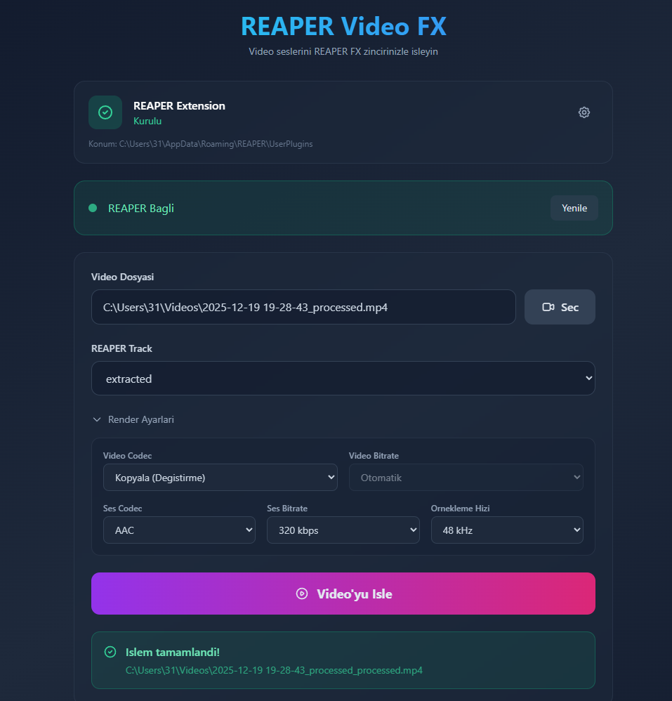

# 🎬 REAPER Video FX

> Process video audio through REAPER's powerful FX chain

[Features](#features) • [Installation](#installation) • [Usage](#usage) • [Development](#development) • [Türkçe](#turkish)

---

## ✨ Features

- **Seamless REAPER Integration** - Process video audio using your favorite REAPER FX plugins
- **One-Click Extension Install** - Automatic REAPER extension installation
- **Manual Path Selection** - Custom REAPER plugins directory support
- **Real-time Progress** - Live feedback during video processing
- **Flexible Export** - Configurable audio/video codecs and bitrates
- **Cross-platform** - Works on Windows, macOS, and Linux

## 🎯 How It Works

1. **Extract** audio from video using FFmpeg
2. **Load** audio into REAPER project
3. **Render** track with your FX chain applied
4. **Merge** processed audio back into video

## 📦 Installation

### Windows

Download and install the latest release:

- **MSI Installer**: \`REAPER Video FX_x.y.z_x64_en-US.msi\` (Recommended)
- **NSIS Installer**: \`REAPER Video FX_x.y.z_x64-setup.exe\`

**REAPER Extension** will be installed automatically on first run, or you can:
- Click the "One-Click Install" button in the app
- Manually copy \`reaper_video_fx_bridge.dll\` to \`%APPDATA%\REAPER\UserPlugins\`

### macOS / Linux

Build from source (see [Development](#development) section)

## 🚀 Usage

1. **Launch REAPER** with your desired FX chain on a track
2. **Open REAPER Video FX** application
3. **Select Video** - Choose your video file
4. **Select Track** - Pick the REAPER track with your FX
5. **Process** - Click "Process" and wait for completion

Output will be saved as \`{original_name}_processed.mp4\` in the same directory.

## 🎛️ Advanced Settings

Click the ⚙️ settings icon to configure:
- **REAPER Plugins Directory** - Manual path selection if auto-detection fails
- **Video Codec** - Default: Copy (no re-encode)
- **Audio Codec** - Default: AAC 320kbps
- **Sample Rate** - Default: 48kHz

## 🛠️ Development

### Prerequisites

- **Windows 10/11** (macOS and Linux supported)
- **REAPER** (tested on 7.49+)
- **Node.js** 18+ and npm
- **Rust** and Cargo
- **FFmpeg** (must be in PATH)
- **Visual Studio 2022 Build Tools** (Windows only, for C++ extension)
- **CMake** (for building REAPER extension)

### Build REAPER Extension

\`\`\`powershell
cd reaper-extension
cmake -S . -B build -G "Visual Studio 17 2022" -A x64
cmake --build build --config Release
\`\`\`

Output: \`reaper-extension/dist/reaper_video_fx_bridge.dll\`

### Run Development Server

\`\`\`powershell
cd tauri-app
npm install
npm run tauri dev
\`\`\`

### Build Production Installers

\`\`\`powershell
cd tauri-app
npm install
npm run tauri build
\`\`\`

Outputs:
- **MSI**: \`src-tauri/target/release/bundle/msi/REAPER Video FX_x.y.z_x64_en-US.msi\`
- **NSIS**: \`src-tauri/target/release/bundle/nsis/REAPER Video FX_x.y.z_x64-setup.exe\`

### Automated Releases (GitHub Actions)

Push a semantic version tag to create a GitHub Release automatically:

\`\`\`bash
git tag v1.0.1
git push origin v1.0.1
\`\`\`

The workflow builds:
- REAPER extension DLL
- Tauri Windows installers (MSI + NSIS)

and uploads them to the matching GitHub Release.

## 📁 Project Structure

\`\`\`
reaper-video-fx/
├── tauri-app/              # Tauri desktop app (Rust + React)
│   ├── src/                # React frontend
│   └── src-tauri/          # Rust backend
├── reaper-extension/       # Native REAPER extension (C++)
├── reaper-scripts/         # Lua bridge (fallback)
└── reaper-sdk-main/        # REAPER SDK headers
\`\`\`

## 🐛 Troubleshooting

### "REAPER Not Connected"
- Ensure REAPER is running
- Install the extension: Click "One-Click Install" or manually copy DLL
- Restart REAPER after extension installation
- Check \`%TEMP%\reaper-video-fx\`for \`command.json\` and \`response.json\`

### Extension Not Found
- Use the ⚙️ settings icon to manually select REAPER plugins directory
- Default path: \`%APPDATA%\REAPER\UserPlugins\`

### Video Processing Fails
- Ensure FFmpeg is installed and in PATH
- Check that video file is not corrupted
- Verify REAPER track has audio items

## 🤝 Contributing

Contributions are welcome! Please feel free to submit a Pull Request.

## 📄 License

MIT License - see [LICENSE](LICENSE) file for details

---

# 🇹🇷 Türkçe Dökümantasyon

## Özellikler

REAPER içindeki FX chain'i kullanarak videoların sesini işleyen cross-platform masaüstü uygulaması.

### Nasıl Çalışır?

1. Videodan ses çıkarılır (FFmpeg)
2. Ses REAPER'a yüklenir
3. Seçilen track (üzerindeki FX'lerle) render alınır
4. İşlenmiş ses tekrar videoya gömülür

## Kurulum (Windows)

### 1. Uygulamayı Yükle

En son sürümü indirin:
- **MSI**: \`REAPER Video FX_x.y.z_x64_en-US.msi\` (Önerilen)
- **NSIS**: \`REAPER Video FX_x.y.z_x64-setup.exe\`

### 2. REAPER Extension

Extension otomatik kurulur, veya manuel olarak:
- Uygulamadaki "Tek Tıkla Kur" butonuna tıklayın
- Manuel: \`reaper_video_fx_bridge.dll\` dosyasını \`%APPDATA%\REAPER\UserPlugins\` klasörüne kopyalayın

## Kullanım

1. REAPER'ı açın, istediğiniz FX chain'i bir track'e ekleyin
2. REAPER Video FX uygulamasını açın
3. Video dosyasını seçin
4. İşlemek istediğiniz REAPER track'i seçin
5. "Process" butonuna tıklayın

Çıktı: \`{video_adi}_processed.mp4\`

## Ayarlar

⚙️ ikonu ile:
- **REAPER Dizini**: Otomatik bulunamazsa manuel seçin
- **Video Codec**: Varsayılan: Copy (yeniden kodlama yok)
- **Ses Codec**: Varsayılan: AAC 320kbps
- **Sample Rate**: Varsayılan: 48kHz

## Geliştirme

### Gereksinimler
- Windows 10/11 (macOS ve Linux desteklenir)
- REAPER (7.49+)
- Node.js 18+ ve npm
- Rust ve Cargo
- FFmpeg (PATH'te olmalı)
- Visual Studio 2022 Build Tools (Windows)
- CMake

### REAPER Extension Build

\`\`\`powershell
cd reaper-extension
cmake -S . -B build -G "Visual Studio 17 2022" -A x64
cmake --build build --config Release
\`\`\`

### Uygulama Geliştirme

\`\`\`powershell
cd tauri-app
npm install
npm run tauri dev
\`\`\`

### Production Build

\`\`\`powershell
cd tauri-app
npm install
npm run tauri build
\`\`\`

## Sorun Giderme

### "REAPER Bağlı Değil"
- REAPER açık mı kontrol edin
- Extension'ı kurun: "Tek Tıkla Kur" butonu
- REAPER'ı yeniden başlatın
- \`%TEMP%\reaper-video-fx\` klasörünü kontrol edin

### Extension Bulunamadı
- ⚙️ ayarlar ikonuna tıklayın
- "Manuel Dizin Seç" ile REAPER UserPlugins klasörünü seçin
- Varsayılan: \`%APPDATA%\REAPER\UserPlugins\`

---

**Made with ❤️ using [Tauri](https://tauri.app) + [React](https://react.dev) + [Rust](https://rust-lang.org)**

